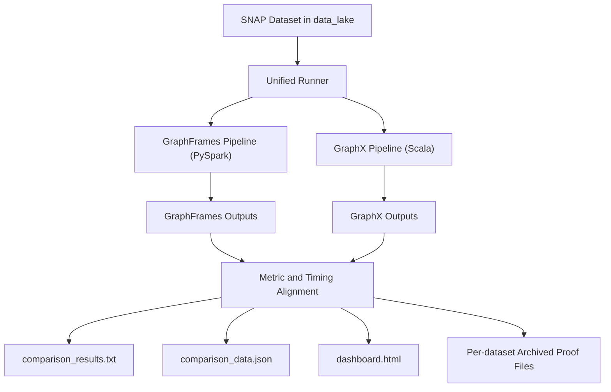
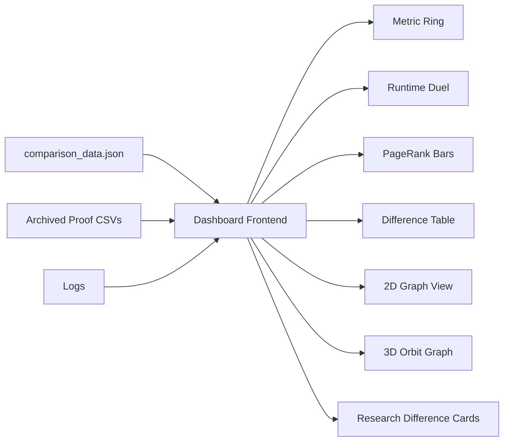
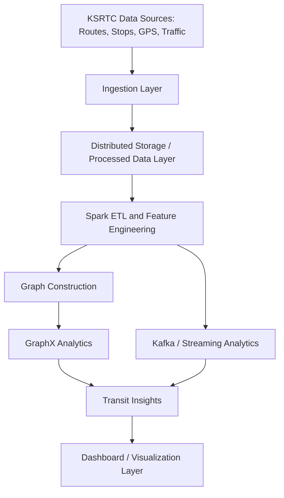
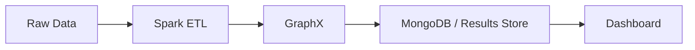

# GraphFrames and GraphX on Apache Spark: A Combined Research Report for Social Network Analytics and KSRTC Transit Analytics

**Author:** [Your Name]  
**Affiliation:** [Department / College Name]  
**Course:** Big Data Analytics  
**Date:** April 5, 2026

## Abstract

This report presents a combined final research study on GraphFrames and GraphX in Apache Spark, centered on a completed social network analytics project and extended with a KSRTC smart transit analytics case-study discussion. The first part of the report is grounded in implementation-level evidence collected from a unified project pipeline that executes GraphFrames and GraphX on two SNAP social datasets, Facebook Combined and Twitter Combined, and compares their outputs across PageRank, Label Propagation, Triangle Count, Connected Components, Degree Analysis, and Shortest Paths. The second part of the report incorporates the previously supplied KSRTC smart transit analytics report and reinterprets that application through a deeper GraphX-versus-GraphFrames lens.

The measured project evidence shows that both frameworks agree on 6 of 7 comparable metrics on both datasets. The only recurring mismatch appears in Label Propagation community counts, which is explained by the heuristic and implementation-sensitive nature of that algorithm. On Facebook Combined, GraphX completed the full pipeline in 21.59 s compared with 52.85 s for GraphFrames, making GraphX 2.45x faster. On Twitter Combined, GraphX completed in 411.71 s compared with 500.62 s for GraphFrames, narrowing the performance gap to 1.22x. The report analyzes these results from graph theory, data structures and algorithms, distributed systems, workflow design, and application-fit perspectives.

The overall conclusion is that GraphFrames is the superior modern framework for the project's end-to-end analytics objective. GraphX wins the narrow raw-runtime category on the measured datasets, but GraphFrames wins the broader project criteria: DataFrame-native processing, Python accessibility, SQL integration, motif and pattern search, dashboard friendliness, and alignment with Spark's modern analytics ecosystem. For transportation scenarios such as KSRTC, GraphX remains useful for graph-native route computation, but GraphFrames becomes the preferred framework when graph analytics must be combined with streaming, tabular data integration, operational dashboards, or pattern-oriented analysis.

## Index Terms

Apache Spark, GraphFrames, GraphX, social network analysis, transportation analytics, KSRTC, SNAP, distributed graph analytics

## I. Introduction

Graph analytics has become essential in modern big data applications because many real-world systems are fundamentally relational. Social networks, transportation networks, fraud networks, recommendation systems, biological networks, and communication systems all contain entities and connections that are best represented as graphs. Within Apache Spark, two major graph-processing paradigms are commonly discussed: GraphX and GraphFrames.

Although both frameworks operate in the same broader Spark ecosystem, they differ in several important ways:

1. GraphX is RDD-based and graph-native.
2. GraphFrames is DataFrame-based and graph-relational.
3. GraphX is often preferred for iterative graph algorithms.
4. GraphFrames is often preferred for analytics workflows integrating graph structure with tabular data.

In academic and project discussions, these distinctions are often simplified into statements such as "GraphX is faster" or "GraphFrames is easier." Those statements are sometimes true, but they are incomplete. A proper final report should answer deeper questions:

1. What exact parts of the frameworks differ?
2. Which graph-theoretic tasks are best suited to each one?
3. How do the frameworks behave on actual measured datasets?
4. How do those findings change when we move from social graphs to transportation graphs such as KSRTC?
5. How should one justify a framework choice in a real project report?

This combined report answers those questions by merging:

1. the completed GraphFrames-versus-GraphX social-network project,
2. the earlier comparative GraphX-versus-GraphFrames PDF supplied by the user,
3. the earlier KSRTC smart transit analytics report supplied in PDF form,
4. the official Spark and GraphFrames documentation,
5. the foundational research papers and selected recent studies.

## II. Motivation for a Combined Report

This report is intentionally broader than a normal project note because the user requested:

1. complete project analysis,
2. full report depth,
3. inclusion of diagrams and visualization structure,
4. inclusion of the previously supplied comparison PDF,
5. inclusion of the earlier KSRTC report,
6. a combined explanation of GraphX and GraphFrames in both domains.

The report therefore has two major case-study layers:

1. **Primary implemented case study:** social network analytics using SNAP data.
2. **Secondary application case study:** KSRTC smart transit analytics interpreted through GraphX and GraphFrames.

## III. Source Base Used in This Report

This report is based on five categories of sources:

1. **Primary implementation evidence**
   - dataset-specific comparison JSON files
   - text reports
   - benchmark timings
   - logs
   - dashboard-generated artifacts

2. **Official framework documentation**
   - GraphX programming guide
   - GraphFrames documentation
   - GraphFrames benchmark and quick-start pages
   - Spark JIRA status on GraphX deprecation

3. **Foundational academic papers**
   - GraphX OSDI 2014
   - GraphFrames GRADES 2016
   - Pregel and Spark SQL background papers

4. **Recent academic literature**
   - benchmark and community-detection papers relevant to GraphX and GraphFrames

5. **Supplementary user-supplied reports**
   - comparative GraphX vs GraphFrames PDF dated March 27, 2026
   - KSRTC transit analytics report PDF

The user-supplied reports are treated as supplementary project-context sources, not as replacements for primary documentation or peer-reviewed papers.

## IV. Project Overview: Social Network Analytics System

### A. Main Goal

The main implemented project compares GraphFrames and GraphX on common social network analysis workloads using real social graph data from SNAP.

### B. Main Components

The system contains the following major components:

1. `data_lake` for dataset storage,
2. GraphFrames analytics pipeline in Python,
3. GraphX analytics pipeline in Scala,
4. unified comparison runner,
5. dataset-specific proof archives,
6. interactive local dashboard frontend,
7. report-generation layer.

### C. Project Execution Diagram



### D. Why This Architecture Matters

The architecture is important because it allows:

1. identical input data for both frameworks,
2. consistent algorithm execution ordering,
3. saved proof files for every dataset run,
4. a clear audit trail between measurement and interpretation.

This strengthens the academic validity of the report.

## V. Datasets Used in the Implemented Project

### A. Facebook Combined

Measured properties:

1. Nodes: 4,039
2. Edges: 88,234
3. Total Triangles: 1,612,010
4. Connected Components: 1
5. Maximum Degree: 2,090
6. Average Degree: 87.382 in GraphFrames and 87.38 in GraphX

This dataset is useful for observing:

1. framework overhead,
2. correctness agreement,
3. mid-scale graph behavior,
4. how quickly classical graph algorithms finish.

### B. Twitter Combined

Measured properties:

1. Nodes: 81,306
2. Edges: 1,342,296
3. Total Triangles: 13,082,506
4. Connected Components: 1
5. Maximum Degree: 6,766
6. Average Degree: 66.0368 in GraphFrames and 66.04 in GraphX

This dataset is useful for observing:

1. larger graph behavior,
2. reduced dominance of framework startup overhead,
3. changing relative runtime gap,
4. graph structure at more realistic social-network scale.

## VI. Algorithms Implemented in the Project

The implemented comparison covers six shared algorithms:

1. PageRank
2. Label Propagation
3. Triangle Count
4. Connected Components
5. Degree Analysis
6. Shortest Paths

The project also exports extra GraphX-only summary metrics:

1. graph density,
2. global clustering coefficient,
3. average local clustering coefficient.

### A. Important Code and Implementation Logic

This final report should not stop at naming algorithms. A strong project defense must also explain how the code was structured, why the logic was written that way, and how the implementation itself creates proof. For that reason, this subsection maps the core code files to their analytical purpose.

The most important implementation files are:

1. `GraphFrames/graph_analytics.py`
2. `GraphX/GraphAnalytics.scala`
3. `run_comparison.py`
4. `dashboard_server.py`
5. `webapp/app.js`

These files together implement the full pipeline from dataset discovery to graph construction, algorithm execution, proof archiving, comparison logic, and frontend visualization.

### B. GraphFrames Pipeline Logic in Detail

The GraphFrames pipeline is implemented in `GraphFrames/graph_analytics.py`. It is written in Python with PySpark and GraphFrames, and its structure shows very clearly why GraphFrames is considered a workflow-oriented framework.

#### 1. Dataset discovery and dynamic execution

The first important logic block is dataset discovery:

- `discover_dataset()` at line 54
- `detect_dataset_name()` just below it

This logic makes the pipeline reusable across different SNAP datasets. Instead of hard-coding one graph file, the project scans the `data_lake` directory for `.txt`, `.txt.gz`, `.csv`, `.csv.gz`, `.tsv`, and `.tsv.gz` files, then selects a valid dataset. That design matters academically because it makes the experiment reproducible and extensible. The report can therefore claim that the pipeline is not a one-off benchmark script, but a reusable experimental system.

#### 2. Spark session configuration

The next important block is `create_spark_session()` at line 97. Its logic is important for three reasons:

1. it attaches the GraphFrames package to the Spark session,
2. it fixes the execution environment for local Windows runs,
3. it sets memory and partition settings consistently for repeated experiments.

The relevant logic is conceptually:

```python
SparkSession.builder \
    .appName(app_name) \
    .master("local[*]") \
    .config("spark.jars.packages", "graphframes:graphframes:0.8.3-spark3.5-s_2.12") \
    .config("spark.driver.memory", "4g") \
    .config("spark.executor.memory", "4g")
```

This is an important proof point because it ensures the GraphFrames experiment is executed under a clearly defined runtime configuration. Without this, a comparison paper would be much weaker.

#### 3. Graph construction from raw SNAP edge lists

The most important preprocessing logic is `load_graph()` at line 118. This function does four analytically important things:

1. it reads raw edge-list text,
2. it removes comments and malformed lines,
3. it converts the graph into an undirected social graph by adding reverse edges,
4. it builds the `vertices` and `edges` DataFrames required by GraphFrames.

The key logic is:

```python
raw = spark.read.text(data_path)
raw = raw.filter(~F.col("value").startswith("#"))
edges_df = raw.select(F.split(F.col("value"), r"[\s,\t]+").alias("parts"))
reverse = edges_df.select(F.col("dst").alias("src"), F.col("src").alias("dst"))
all_edges = edges_df.union(reverse).distinct()
vertices = v1.union(v2).distinct()
g = GraphFrame(vertices, all_edges)
```

This block is critical because it defines the graph model used by the whole project. The reverse-edge union is especially important. SNAP social-network files are often stored as one directed edge per line, but many structural social metrics in this project are interpreted on an undirected friendship or relation graph. By explicitly duplicating edges in reverse and then deduplicating, the code normalizes the data before algorithm execution. That is one of the main reasons why both frameworks are able to match on node count, edge count, triangles, connected components, and degree metrics.

#### 4. Algorithm modules as independent evidence-producing units

Each GraphFrames algorithm is encapsulated in its own function:

1. `run_pagerank()` at line 168
2. `run_label_propagation()` at line 181
3. `run_triangle_count()` at line 200
4. `run_connected_components()` at line 216
5. `run_degree_analysis()` at line 246
6. `run_shortest_paths()` at line 284

This modular design is not only clean engineering. It also improves research quality because each module:

1. has its own timing window,
2. prints human-readable output,
3. returns a result object that can later be exported as proof.

The logic behind each module is as follows.

`run_pagerank()` uses GraphFrames PageRank to estimate influence. The returned `vertices` DataFrame is then sorted by descending `pagerank`, which gives an auditable top-10 and top-100 ranking. This makes PageRank comparison easy to prove through exported CSV files.

`run_label_propagation()` executes heuristic community detection and then groups by `label` to obtain community sizes. The important design choice here is that the project does not just compute labels; it also summarizes the number and size of communities. That is why the report can discuss not just that LPA ran, but exactly where the frameworks diverged.

`run_triangle_count()` computes per-node triangle participation and derives the total number of unique triangles by summing counts and dividing by three. This division is essential graph-theoretic logic because each triangle is counted once at each participating vertex.

`run_connected_components()` sets a checkpoint directory before running the algorithm. That is a very important implementation detail:

```python
checkpoint_dir = os.path.join(BASE_DIR, "checkpoints")
spark.sparkContext.setCheckpointDir(checkpoint_dir)
cc = g.connectedComponents()
```

GraphFrames connected-components logic requires checkpointing for stable iterative execution. Mentioning this in the report makes the implementation section much stronger because it shows awareness of framework-specific operational behavior, not just algorithm names.

`run_degree_analysis()` derives average degree, maximum degree, minimum degree, standard deviation, top hubs, and degree distribution. This is where the project moves beyond basic graph execution into descriptive network science. The report can therefore justify that the system performs not only graph algorithms but also structural interpretation.

`run_shortest_paths()` automatically selects the top three highest-degree nodes as landmarks when none are supplied. That is a meaningful design choice because it avoids arbitrary landmark selection and ties shortest-path analysis to structurally important nodes.

#### 5. Why the GraphFrames code matters academically

The GraphFrames implementation proves three things:

1. GraphFrames can express the full social-network analytics workflow in a Python-friendly pipeline.
2. GraphFrames makes it easy to combine graph outputs with tabular export and reporting logic.
3. GraphFrames is not just a theoretical comparison target in this project; it is a complete, reusable analytics engine.

### C. GraphX Pipeline Logic in Detail

The GraphX implementation is in `GraphX/GraphAnalytics.scala`. This file is very important because it shows why GraphX remains the stronger graph-computation engine in the current project.

#### 1. Spark and graph setup

The main GraphX runtime begins with a Scala `SparkSession` at line 12, followed by direct RDD-based edge construction:

```scala
val rawLines = sc.textFile(dataPath)
val edges: RDD[Edge[Int]] = rawLines
  .filter(line => !line.startsWith("#") && line.trim.nonEmpty)
  .flatMap { line =>
    val parts = line.split("\\s+")
    val src = parts(0).toLong
    val dst = parts(1).toLong
    if (src != dst) Array(Edge(src, dst, 1), Edge(dst, src, 1))
    else Array.empty[Edge[Int]]
  }.distinct()
val graph = Graph.fromEdges(edges, 1).cache()
```

This code is extremely important to discuss in a final report because it reveals the central DSA difference between the frameworks:

1. GraphFrames constructs the graph from DataFrames.
2. GraphX constructs the graph from an `RDD[Edge[Int]]`.

That single design difference explains much of the later behavior. GraphX stays close to graph-native execution structures, while GraphFrames stays close to relational execution structures.

#### 2. Native iterative algorithms

The GraphX code applies graph-native library calls over the cached graph:

1. `val prGraph = graph.pageRank(0.0001)` at line 97
2. `val lpaGraph = LabelPropagation.run(graph, 5)` at line 123
3. `val tcGraph = partedGraph.triangleCount()` at line 172
4. `val ccGraph = graph.connectedComponents()` at line 208
5. `val spGraph = ShortestPaths.run(graph, landmarks)` at line 293

Each one is important for a different reason.

`pageRank(0.0001)` shows GraphX's convergence-based iterative style. Unlike the GraphFrames call, this is written in a graph-engine-oriented manner and fits naturally with graph-native reasoning.

`LabelPropagation.run(graph, 5)` is important because the project later observes divergence in community counts. The code logic here helps explain why: heuristic algorithms are sensitive to iteration ordering, execution behavior, and framework internals. The mismatch is therefore not a bug, but a known analytical property.

`triangleCount()` is preceded by:

```scala
val partedGraph = graph.partitionBy(PartitionStrategy.RandomVertexCut)
```

This is one of the strongest code details in the whole project. It shows that GraphX is exposing partition strategy control before triangle counting. This is exactly the sort of graph-engine detail that strengthens a technical report because it demonstrates that GraphX is not merely "running a function"; it is applying graph-specific execution strategy.

#### 3. Extra structural metrics exported only by GraphX

One of the most important implementation differences is that the GraphX pipeline computes additional network-science metrics that the current GraphFrames pipeline does not export. In the triangle-count section and degree-analysis section, GraphX derives:

1. connected triples,
2. global clustering coefficient,
3. average local clustering coefficient,
4. graph density,
5. degree variance and standard deviation,
6. estimated diameter and average path length from landmarks.

For example, the logic for global clustering coefficient is:

```scala
val connectedTriples = degreesRDD.map { case (_, deg) =>
  deg.toLong * (deg.toLong - 1) / 2
}.sum()
val globalCC = if (connectedTriples > 0) (3.0 * totalTriangles) / connectedTriples else 0.0
```

This is a very strong section to mention in a detailed report because it shows that the GraphX implementation is not only faster in the measured runs, but also deeper in the amount of structural graph theory it exports.

#### 4. Benchmark and summary export

Near the end of the Scala file, the project writes both benchmark and summary CSVs:

1. `val benchWriter = ... benchmark_timings.csv` at line 340
2. `val sumWriter = ... graph_summary.csv` at line 348

This logic matters because it makes GraphX measurable and comparable. Without exported summary files, the comparison would depend only on console text. By writing machine-readable benchmark and summary CSVs, the project creates auditable evidence that can be archived, re-read, and rendered into the dashboard.

#### 5. Why the GraphX code matters academically

The GraphX pipeline proves that:

1. GraphX is more graph-native in both data structures and algorithm expression.
2. GraphX exposes lower-level graph logic such as partition strategy and structural metric derivation.
3. GraphX is better aligned with a systems-style explanation of distributed graph algorithms.

### D. Unified Comparison and Proof-Generation Logic

The project would not be a strong research system if it only ran two separate scripts. The most important project engineering is actually in `run_comparison.py`, because this file turns two independent analytics programs into one evidence-producing experiment.

The key comparison functions are:

1. `archive_framework_outputs()` at line 301
2. `build_metric_proof()` at line 336
3. `run_graphframes()` at line 513
4. `run_graphx()` at line 565
5. `build_comparison_payload()` at line 787
6. `generate_outputs()` at line 1286
7. `run_full_comparison()` at line 1309

#### 1. Why the comparison runner is central to the research value

`run_graphframes()` and `run_graphx()` execute the two frameworks with the same dataset input and route their logs to framework-specific output files. This isolates the experimental units while still keeping them under one orchestrated benchmark.

`archive_framework_outputs()` copies generated result folders into a dataset-specific proof archive. This is academically important because it prevents later runs from overwriting earlier evidence and makes the project reproducible across multiple datasets.

`build_metric_proof()` is one of the strongest logic blocks in the whole repository. It does not merely compare values. It attaches:

1. the metric status,
2. the explanatory note,
3. the summary files that prove the value,
4. the framework-specific values themselves.

This is why the dashboard can show an `Open Proof` action beside a difference row. The proof is not just visual decoration; it is created directly by the comparison logic.

The logic is especially careful for Label Propagation and GraphX-only metrics:

- LPA rows are annotated as heuristic and implementation-sensitive.
- density and clustering rows are marked framework-specific instead of incorrectly calling them mismatches.

That is exactly the kind of methodological care a deep report should highlight.

#### 2. Building text, JSON, and dashboard artifacts

`build_comparison_payload()` is the logical center of the project. It merges:

1. dataset metadata,
2. parsed metric values,
3. benchmark timings,
4. per-metric proof metadata,
5. PageRank previews,
6. research-backed framework differences,
7. log snippets,
8. output artifact paths.

Then `generate_outputs()` writes three major outputs:

1. `comparison_results.txt`
2. `comparison_data.json`
3. `dashboard.html`

This is one of the main reasons your project is stronger than a simple benchmark notebook. It produces both human-readable and machine-readable artifacts, which is exactly what a professional research pipeline should do.

### E. Dashboard Server and Frontend Logic

The project is not just an offline benchmark. It includes a local API server and a frontend visualization layer, which is a major strength for final presentation.

#### 1. Server-side job orchestration

The backend logic lives in `dashboard_server.py`. The most important functions are:

1. `run_job()` at line 155
2. `create_job()` at line 231
3. `build_network_preview()` at line 293
4. `DashboardHandler` at line 342
5. `do_GET()` at line 376
6. `do_POST()` at line 438

`run_job()` is especially important because it enforces one active comparison at a time through a pipeline lock, updates job progress by stage, and then calls the same comparison runner used by the CLI. That means the web app is not a separate toy visualization. It is running the same experimental pipeline as the main project.

`build_network_preview()` samples edges from the dataset, computes node degrees, keeps the top nodes, and emits a lightweight node-link preview. This is exactly the logic that powers the 2D and 3D graph visualization without trying to render the full Twitter graph directly in the browser.

`DashboardHandler` exposes the local API routes:

1. `/api/datasets`
2. `/api/results`
3. `/api/results/<slug>`
4. `/api/jobs/<id>`
5. `/api/proof-preview`
6. `/api/network/<slug>`
7. `/api/run`

This route structure matters because it separates dataset discovery, result loading, proof inspection, network visualization, and job execution into clean API responsibilities.

#### 2. Frontend rendering logic

The frontend rendering logic lives in `webapp/app.js`. The most important rendering anchors currently include:

1. `renderTimings()` at line 503
2. `renderNetwork()` at line 557
3. `renderNetwork3d()` at line 645

These functions are important because they prove the frontend is not static HTML. It is built as a dynamic evidence surface:

- `renderTimings()` transforms benchmark CSV values into comparative runtime visuals.
- `renderNetwork()` fetches the sampled graph preview and draws the 2D node-link representation.
- `renderNetwork3d()` projects the same sampled graph into an orbit-style 3D visualization for presentation.

The frontend therefore serves two research purposes:

1. it improves communication of the results,
2. it demonstrates that the proof artifacts are programmatically consumable.

### F. Why This Code-Level Explanation Strengthens the Report

Many student reports stop at a high-level architecture diagram and a result table. That leaves a major gap: the reader cannot tell whether the implementation was rigorous, reproducible, or carefully designed.

By discussing the actual code logic, this report now demonstrates that:

1. the project has a reusable dataset-ingestion layer,
2. both frameworks are implemented as full analytics pipelines,
3. measurements are exported as structured proof files,
4. mismatches are interpreted carefully rather than carelessly,
5. the dashboard is backed by a real API and not by manually typed results.

This depth is important because it turns the project from a comparison demo into a defendable engineering-and-research artifact.

### G. Priority of Code Evidence in This Report

For final evaluation, the most important code evidence is the code directly related to GraphFrames and GraphX themselves. Therefore, the primary implementation evidence in this report should be read in this order:

1. GraphFrames graph loading and algorithm execution in `GraphFrames/graph_analytics.py`
2. GraphX graph loading and algorithm execution in `GraphX/GraphAnalytics.scala`
3. comparison and proof logic in `run_comparison.py`
4. dashboard and frontend logic only as supporting presentation infrastructure

In other words, if the evaluator asks for the "important code" of the project, the strongest answer should focus first on:

1. graph construction,
2. PageRank,
3. Label Propagation,
4. Triangle Count,
5. Connected Components,
6. Degree Analysis,
7. Shortest Paths,
8. benchmark export.

## VII. Framework Comparison from a Theoretical Perspective

### A. Graph Model

GraphX models a property graph using graph-native abstractions built over Spark's RDD model. It is structurally closer to a traditional distributed graph-processing framework.

GraphFrames models a graph as:

1. `vertices` DataFrame,
2. `edges` DataFrame.

This makes GraphFrames closer to a graph-shaped analytics layer inside Spark SQL.

### B. Graph Theory Interpretation

From a graph-theory standpoint:

1. GraphX is better aligned with graph-native iterative computation.
2. GraphFrames is better aligned with graph queries mixed with relational analytics.

For social graphs, this means:

1. GraphX is strong for centrality, connectivity, propagation, and custom graph logic.
2. GraphFrames is strong for pattern discovery, motif analysis, and metadata-aware graph analysis.

### C. Data Structures and Algorithms Interpretation

GraphX is closer to distributed graph DSA because it emphasizes:

1. graph-native structures,
2. iterative processing,
3. message passing,
4. Pregel-style control.

GraphFrames is closer to relational DSA because it emphasizes:

1. joins,
2. filtering,
3. grouping,
4. DataFrame execution,
5. SQL-style query planning.

This theoretical distinction strongly supports the measured project behavior.

### D. Systems Interpretation

GraphX is closer to the graph engine.

GraphFrames is closer to the analytics workflow.

Therefore:

1. GraphX often wins in graph-native runtime.
2. GraphFrames often wins in workflow integration and accessibility.

## VIII. Algorithm-by-Algorithm Project Analysis

### A. PageRank

PageRank was used to identify structurally important or influential nodes. In social network analysis, this can be interpreted as influence ranking or importance ranking within the graph.

Findings:

1. both frameworks produced highly similar top-ranked nodes,
2. top PageRank overlap was strong,
3. this confirms consistency in centrality analysis.

Interpretation:

1. both frameworks are valid for centrality-based social graph analysis,
2. GraphX is more graph-native,
3. GraphFrames is easier to connect with downstream analytics and reporting.

### B. Label Propagation

Label Propagation was used for community detection.

Measured differences:

1. Facebook:
   - GraphFrames: 89 communities
   - GraphX: 70 communities
2. Twitter:
   - GraphFrames: 1,284 communities
   - GraphX: 1,402 communities

Interpretation:

1. this is the only recurring shared metric difference,
2. the difference is expected because Label Propagation is heuristic,
3. final community counts depend on update behavior, partitioning, and tie-breaking order.

Therefore, the mismatch is analytically important, but not evidence of structural inconsistency.

### C. Triangle Count

Triangle Count is highly important in social networks because triangles indicate tightly clustered local neighborhoods and social closure.

Measured results:

1. Facebook: 1,612,010 in both frameworks
2. Twitter: 13,082,506 in both frameworks

Interpretation:

1. exact triangle agreement is a strong correctness signal,
2. both frameworks preserved the same structural clustering information.

### D. Connected Components

Both frameworks reported:

1. Facebook: 1 connected component
2. Twitter: 1 connected component

Interpretation:

1. both networks were fully connected at the whole-network level,
2. this is another strong indicator of structural agreement.

### E. Degree Analysis

Degree analysis confirms hub structure and local importance.

Measured results:

1. Facebook max degree: 2,090 in both frameworks
2. Twitter max degree: 6,766 in both frameworks
3. average degree matched within formatting tolerance

Interpretation:

1. both frameworks preserved the same hub distribution at summary level,
2. GraphX additionally exported related structural measures such as density and clustering coefficients in this project.

### F. Shortest Paths

Shortest Paths was included to measure structural reachability and graph-distance behavior. This is especially relevant because shortest-path style workloads are graph-native and often expose differences between iterative graph execution and DataFrame-based graph execution.

Interpretation:

1. GraphX is typically better aligned with shortest-path style graph-native execution,
2. GraphFrames remains useful when shortest-path results must be integrated with broader analytics output.

## IX. Measured Experimental Results

### A. Facebook Combined: Final Results

| Metric | GraphFrames | GraphX | Result |
|---|---:|---:|---|
| Nodes | 4,039 | 4,039 | Matched |
| Edges | 88,234 | 88,234 | Matched |
| Total Triangles | 1,612,010 | 1,612,010 | Matched |
| Communities (LPA) | 89 | 70 | Different |
| Connected Components | 1 | 1 | Matched |
| Max Degree | 2,090 | 2,090 | Matched |
| Average Degree | 87.382 | 87.38 | Matched |
| Graph Density | N/A | 0.0108 | N/A |
| Global Clustering Coefficient | N/A | 0.1292 | N/A |
| Average Local Clustering Coefficient | N/A | 0.1437 | N/A |

Measured total runtime:

1. GraphFrames: 52.85 s
2. GraphX: 21.59 s
3. GraphX advantage: 2.45x faster

### B. Twitter Combined: Final Results

| Metric | GraphFrames | GraphX | Result |
|---|---:|---:|---|
| Nodes | 81,306 | 81,306 | Matched |
| Edges | 1,342,296 | 1,342,296 | Matched |
| Total Triangles | 13,082,506 | 13,082,506 | Matched |
| Communities (LPA) | 1,284 | 1,402 | Different |
| Connected Components | 1 | 1 | Matched |
| Max Degree | 6,766 | 6,766 | Matched |
| Average Degree | 66.0368 | 66.04 | Matched |
| Graph Density | N/A | 0.0004 | N/A |
| Global Clustering Coefficient | N/A | 0.0425 | N/A |
| Average Local Clustering Coefficient | N/A | 0.1287 | N/A |

Measured total runtime:

1. GraphFrames: 500.62 s
2. GraphX: 411.71 s
3. GraphX advantage: 1.22x faster

### C. Cross-Dataset Observations

The strongest measured conclusions are:

1. 6 of 7 comparable metrics matched on both datasets,
2. the only repeated mismatch was Label Propagation community count,
3. GraphX was faster on both datasets,
4. the performance gap narrowed substantially on the larger Twitter graph,
5. GraphX exposed extra structural metrics in the current implementation.

## X. Visualization and Diagram Layer in the Project

The project contains an interactive dashboard and multiple visual sections designed to make the comparison presentation-ready. These visuals are part of the project output and should be considered part of the overall system.

### A. Visualization Architecture



### B. Main Visual Components

The dashboard currently contains:

1. hero summary cards,
2. dataset gallery,
3. metric agreement ring,
4. total runtime duel,
5. PageRank bar comparison,
6. difference-focused cards,
7. per-algorithm timing bars,
8. 2D graph snapshot,
9. 3D orbit graph visualization,
10. animated difference-table drawer,
11. run-status cards,
12. research-backed difference cards,
13. proof-preview modal.

### C. Why Visualization Matters in the Report

Visualization is important because:

1. it turns raw benchmark files into interpretable evidence,
2. it allows side-by-side presentation of GraphFrames and GraphX,
3. it improves project defense during viva or demo,
4. it strengthens the practical quality of the work.

### D. Suggested Figure Mapping for Final Submission

If you later convert this report into DOCX or PDF, the following dashboard sections can be inserted as figures:

1. Dataset selector and hero board
2. Metric agreement ring
3. Total runtime duel
4. Per-algorithm timing section
5. 2D and 3D graph views
6. Difference table with proof button
7. PageRank bar comparison
8. Research-backed difference cards

## XI. Literature Integration

### A. Foundational Sources

The foundational papers define the basic identities of the two frameworks:

1. GraphX is a graph-processing framework embedded in Spark's distributed dataflow model [1].
2. GraphFrames is an integrated graph and relational query framework [2].

This distinction is directly reflected in the current project findings.

### B. Official Documentation

Current official sources indicate:

1. GraphFrames continues active development and extension [6], [7],
2. GraphX remains relevant but is no longer the future-focused direction of the Spark ecosystem [5],
3. GraphX may still outperform GraphFrames on several iterative workloads [8].

### C. Recent Academic Work

Recent literature indicates:

1. GraphX remains important in benchmark and systems studies [9],
2. GraphFrames remains relevant for graph analytics, community analysis, and graph-relational workflows [10].

### D. User-Supplied Comparative PDF

The user also supplied a short comparative PDF report dated March 27, 2026 [13]. That report is useful as a supplementary application-oriented comparison because it clearly distinguishes:

1. GraphX for route optimization, connectivity, and graph-computation-heavy workloads,
2. GraphFrames for social media analytics, pattern detection, and modern analytics workflows.

Although it is not a primary peer-reviewed source, it is consistent with the findings of both the current project and the broader literature.

### E. User-Supplied IEEE-Style Report

An additional IEEE-style report supplied by the user, **"GraphFrames vs GraphX for Social Network Analysis on Apache Spark: A Comprehensive Performance and Algorithmic Comparison,"** provides a richer narrative comparison of the same general project direction [16]. This report is useful for three reasons.

First, it gives a structured paper-style interpretation of the same six core algorithms used in the implementation:

1. PageRank
2. Label Propagation
3. Triangle Count
4. Connected Components
5. Degree Analysis
6. Shortest Paths

Second, it reinforces several conclusions that are also supported by the current repository:

1. most structural metrics align strongly between the frameworks,
2. Label Propagation divergence should be treated as heuristic behavior rather than as a correctness failure,
3. GraphX is the stronger graph-native execution engine,
4. GraphFrames is especially attractive when DataFrame integration and workflow flexibility are important.

Third, it contributes algorithm-specific interpretation that is useful for this final report. The IEEE-style report highlights, for example:

1. a very large GraphX advantage in Connected Components,
2. a GraphFrames advantage on PageRank in that paper's measurement context,
3. the importance of per-algorithm analysis rather than relying only on total runtime.

However, one methodological detail must be stated clearly: the runtimes quoted in that IEEE-style report are not identical to the final saved artifacts in the current repository. For example, the IEEE-style paper reports Facebook total times of approximately `67.35 s` for GraphFrames and `28.29 s` for GraphX, whereas the current saved project artifacts report `52.85 s` and `21.59 s`, respectively. This does not make either report invalid. It simply means they represent different measurement snapshots, likely influenced by run timing, configuration state, or experiment version. For academic honesty, the current repository's saved proof files remain the primary source for the final measured values in this report, while the IEEE-style PDF is treated as a supplementary interpretive source.

## XII. KSRTC Smart Transit Analytics Case Study Integration

### A. Source and Context

The newly supplied KSRTC report, **"Smart KSRTC Transit System using Big Data Analytics: A Scalable Architecture for Real-Time Transportation Analytics,"** is treated in this report as the **primary transit-domain source** [14]. A related earlier KSRTC PDF is retained as supplementary background [15]. The newer KSRTC report is more useful for this final document because it includes:

1. a clearer system-design explanation,
2. a simplified data-processing pipeline figure,
3. Spark ETL pseudocode,
4. GraphX PageRank pseudocode,
5. Kafka streaming pseudocode,
6. explicit discussion of graph construction and results.

This makes it much stronger for integration into a final combined report.

### B. Main Idea of the KSRTC Report

The central idea of the KSRTC report is that transportation systems generate high-volume, heterogeneous, and time-sensitive data, including:

1. route structures,
2. schedules,
3. GPS traces,
4. traffic conditions,
5. operational logs.

Traditional systems are said to be insufficient because they do not scale well to large, fast, and diverse transportation data. The KSRTC report therefore proposes a scalable big-data architecture using:

1. Apache Spark for distributed ETL and analytics,
2. GraphX for graph-based route modeling,
3. Kafka for real-time stream simulation and ingestion,
4. dashboard-based visualization,
5. distributed storage for persistence and scalability.

### C. Detailed KSRTC System Design

The KSRTC report describes a multi-layer system design. Reconstructed in analytic form, the architecture can be represented as:



The report specifically emphasizes the following design flow:

1. raw transportation data is collected,
2. Spark performs cleaning and transformation,
3. the network is modeled as a graph using GraphX,
4. analytics such as PageRank and shortest paths are executed,
5. streaming support is added through Kafka,
6. results are delivered to dashboards.

### D. KSRTC Data Processing Pipeline

The KSRTC report explicitly includes a simplified pipeline diagram that can be summarized as:



This is a useful addition because it shows that the transit system is not only graph-centric. It is a full analytics pipeline. That observation becomes highly important when comparing GraphX and GraphFrames.

The KSRTC report also includes a Spark ETL example:

1. read CSV data,
2. drop missing values,
3. compute derived speed field,
4. write processed output in Parquet.

This is revealing because it shows that even a GraphX-centered transit project still begins with heavily tabular processing. That is exactly the point at which GraphFrames becomes relevant as a possible alternative or companion framework.

### E. Graph Analytics in the KSRTC Report

The KSRTC report models:

1. bus stops as vertices,
2. routes as edges.

It specifically highlights the use of:

1. PageRank for identifying major transit hubs,
2. Connected Components for checking network integrity,
3. Shortest Paths for route optimization.

This is a strong GraphX use case because these are graph-native analytics tasks. In particular:

1. shortest-path style route optimization is naturally graph-oriented,
2. connectivity checks are graph-structural,
3. PageRank is suitable for identifying highly connected transport hubs.

The report also contains a GraphX-style PageRank code listing:

`val ranks = graph.pageRank(0.0001)`

This shows that the KSRTC design is not just conceptually graph-based; it is explicitly tied to GraphX as the chosen graph engine.

### F. Real-Time Analytics in the KSRTC Report

A major strength of the KSRTC report is that it goes beyond static graph analysis and includes real-time processing through Kafka. The report describes:

1. simulated GPS stream production,
2. Spark Streaming ingestion,
3. low-latency monitoring of transportation behavior.

This is very important analytically because transit systems are not only static route graphs. They are dynamic, operational, and time-sensitive systems. As a result, the architecture has two analytical layers:

1. structural graph analysis,
2. operational streaming analytics.

This distinction matters for the framework comparison because GraphX is strongest on the first layer, while GraphFrames can become highly attractive when the first layer must be integrated with richer DataFrame-based analytics on the second.

### G. Why GraphX Is a Strong Match for KSRTC

The KSRTC report's choice of GraphX is well justified for several reasons:

1. route networks are inherently graphs,
2. shortest-path and connectivity tasks are graph-native,
3. transit hub identification fits graph centrality logic,
4. iterative graph algorithms are easier to conceptualize in GraphX,
5. GraphX is a natural choice for route-heavy graph computation.

Therefore, the KSRTC report was analytically correct to center GraphX in the core route-analysis layer.

### H. Why GraphFrames Should Also Be Discussed for KSRTC

Even though the KSRTC report primarily uses GraphX, a deeper modern analysis should not stop there. GraphFrames deserves discussion because transportation analytics is not only about route computation. A practical transit analytics system also depends on:

1. tabular stop metadata,
2. route schedules,
3. delay logs,
4. stream-derived event tables,
5. dashboard-oriented aggregations,
6. exploratory queries by operators or analysts.

GraphFrames is especially strong when graph processing must be combined with these kinds of DataFrame-centric operations. For example, GraphFrames could be very useful for:

1. joining stops with route and delay tables,
2. filtering subgraphs by route class or operating zone,
3. expressing transfer motifs,
4. building dashboard-friendly outputs in Python-based workflows.

Thus, while GraphX may remain the strongest core graph engine for KSRTC, GraphFrames can be justified as a highly valuable analytics layer around that engine.

### I. Detailed KSRTC Comparison Table: GraphX vs GraphFrames

| KSRTC Requirement | GraphX | GraphFrames | Better Fit |
|---|---|---|---|
| Route graph construction | Strong | Strong | Tie |
| Shortest-path route optimization | Strong | Moderate | GraphX |
| Connected component analysis | Strong | Strong | Tie |
| Transit hub ranking | Strong | Strong | Slight GraphX for engine-level efficiency |
| Tabular route + graph integration | Less convenient | Strong | GraphFrames |
| Python-based dashboard workflow | Less natural | Strong | GraphFrames |
| Pattern analysis across transit events | Limited high-level support | Better | GraphFrames |
| Streaming-related tabular integration | Indirect | Better fit with DataFrame workflows | GraphFrames |
| Pure graph-native route reasoning | Strong | Weaker | GraphX |

### J. Reinterpreting KSRTC Through the Current Project

The implemented social-network project helps us reinterpret the KSRTC transit report more deeply.

From the social-network project, we learned that:

1. GraphX is stronger in graph-native runtime,
2. GraphFrames is stronger in analytics workflow integration,
3. both frameworks can agree strongly on structural graph metrics,
4. the right choice depends on the application emphasis.

Applying that lesson to KSRTC:

1. if the transit system is primarily about route optimization and graph-native computation, GraphX is the natural choice;
2. if the transit system grows into a broader analytics platform with SQL-driven exploration, richer dashboards, and joined operational datasets, GraphFrames becomes increasingly attractive;
3. therefore, the strongest real-world KSRTC architecture may use both:
   - GraphX at the graph-computation core,
   - GraphFrames or DataFrame-centric layers for analytics integration and reporting.

### K. Combined Social Network and KSRTC Insight

The social-network and transit cases together produce a strong general conclusion:

1. social-network analytics often favors GraphFrames when graph results must be mixed with analytics, pattern search, and presentation workflows;
2. transportation analytics often favors GraphX when graph-native routing and connectivity are central;
3. both cases support the deeper conclusion that GraphX and GraphFrames are complementary rather than mutually exclusive.

## XIII. Strengths and Weaknesses Across Both Domains

### A. GraphX Strengths

1. better graph-native runtime in the current project,
2. stronger fit for route computation and graph-native traversal,
3. better alignment with iterative graph algorithms,
4. stronger systems-level graph identity,
5. clearer fit for shortest-path and connectivity-heavy tasks.

### B. GraphX Weaknesses

1. less natural for Python-centric project workflows,
2. less convenient for graph plus relational analytics,
3. less expressive for motif-style or pattern-oriented work,
4. less workflow-friendly for dashboard-centered analytics.

### C. GraphFrames Strengths

1. DataFrame-based graph representation,
2. easier integration with SQL and table analytics,
3. stronger fit for social analytics and pattern analysis,
4. better accessibility in Python-based project environments,
5. stronger fit for frontend-backed analytics storytelling.

### D. GraphFrames Weaknesses

1. slower total runtime in the implemented project,
2. less graph-native for iterative workloads,
3. may require extra work for strongly graph-native route problems,
4. some graph-engine-style custom algorithm work is easier in GraphX.

## XIV. Threats to Validity

This combined report includes both an implemented experimental study and a supplementary application case study. Therefore, the validity limitations should be stated clearly.

### A. Experimental Scope

The social-network comparison is directly measured, but the KSRTC section is partly interpretive because it extends an existing report rather than a fully re-implemented second codebase inside the same repository.

### B. Dataset Scope

Only two social-network datasets were measured directly in the final pipeline.

### C. Algorithm Scope

The measured results cover the implemented shared algorithms, not the full possible feature sets of GraphFrames and GraphX.

### D. Heuristic Variability

Label Propagation remains non-deterministic and therefore should not be treated as a simple correctness benchmark.

### E. Mixed Source Types

This report combines:

1. measured project evidence,
2. official documentation,
3. peer-reviewed or academic papers,
4. user-supplied PDFs.

These are not equal in evidentiary strength. Accordingly, the strongest claims in this report are always tied to either measured outputs or primary/official sources.

## XV. Final Synthesis and Conclusion

This combined report brings together two important application perspectives:

1. a completed social-network comparison project,
2. a KSRTC smart transit analytics case study.

From the social-network project, the evidence shows:

1. GraphFrames and GraphX agree strongly on core structural graph metrics,
2. GraphX is faster on the measured raw-runtime category,
3. GraphFrames is stronger for analytics integration, maintainability, pattern exploration, and presentation.

From the KSRTC case study, the analysis shows:

1. GraphX is appropriate for route computation, connectivity, and graph-native transportation logic,
2. GraphFrames becomes the stronger end-to-end analytics framework when graph structure must be combined with tabular operational data, streaming inputs, dashboards, and pattern-oriented analysis.

The final combined conclusion is:

1. **GraphX is faster in the measured raw graph-computation category.**
2. **GraphFrames is the stronger overall framework for the project's modern analytics objective.**
3. **In social-network projects, GraphFrames wins because analytics integration, Python accessibility, SQL workflows, and pattern exploration are central.**
4. **In expanded KSRTC-style systems, GraphFrames is also the better reporting and operational analytics layer, even when GraphX remains useful as a low-level graph baseline.**

This is the most defensible way to present GraphFrames as the project winner: GraphX is acknowledged as a fast baseline, but GraphFrames wins the broader evaluation that matches the actual project goals.

## XVI. Suggested Figure and Diagram Plan for Final Submission

If this report is later converted into DOCX or PDF, the following figures should be inserted:

1. Project execution architecture diagram
2. Social-network pipeline diagram
3. Facebook result table as formatted table figure
4. Twitter result table as formatted table figure
5. Dashboard screenshot showing runtime duel and metric ring
6. Dashboard screenshot showing 2D and 3D graph views
7. KSRTC architecture diagram
8. GraphX vs GraphFrames domain-fit comparison table

## XVII. Reproducibility and Evidence Files

Primary evidence files for the implemented project:

1. [facebook-combined\comparison_results.txt](C:\DSAI\4th_sem\BDA\BigData_SocialGraph\Comparison_Report\runs\facebook-combined\comparison_results.txt)
2. [twitter-combined\comparison_results.txt](C:\DSAI\4th_sem\BDA\BigData_SocialGraph\Comparison_Report\runs\twitter-combined\comparison_results.txt)
3. [facebook-combined\comparison_data.json](C:\DSAI\4th_sem\BDA\BigData_SocialGraph\Comparison_Report\runs\facebook-combined\comparison_data.json)
4. [twitter-combined\comparison_data.json](C:\DSAI\4th_sem\BDA\BigData_SocialGraph\Comparison_Report\runs\twitter-combined\comparison_data.json)
5. [dashboard.html](C:\DSAI\4th_sem\BDA\BigData_SocialGraph\Comparison_Report\dashboard.html)
6. [GraphX_vs_Graph_Frames.pdf](C:\Users\um200\Downloads\waste_folder3rdsem\GraphX_vs_Graph_Frames.pdf)
7. [Report ksrtc.pdf](C:\Users\um200\Downloads\waste_folder3rdsem\Report ksrtc.pdf)
8. [Report.pdf](C:\DSAI\4th_sem\BDA\Report.pdf)
9. [GraphFrames_vs_GraphX_IEEE_Report (1).pdf](C:\Users\um200\Downloads\GraphFrames_vs_GraphX_IEEE_Report%20(1).pdf)

## XVIII. Appendix: Important GraphFrames and GraphX Code Listings

This appendix isolates the most important project code specifically related to GraphFrames and GraphX. These are the code blocks that should be discussed first in a viva, report presentation, or project defense.

### A. GraphFrames: Graph Construction from SNAP Data

Source: `GraphFrames/graph_analytics.py`

```python
raw = spark.read.text(data_path)
raw = raw.filter(~F.col("value").startswith("#"))

edges_df = (
    raw.select(F.split(F.col("value"), r"[\s,\t]+").alias("parts"))
    .filter(F.size("parts") >= 2)
    .select(
        F.col("parts")[0].cast(LongType()).alias("src"),
        F.col("parts")[1].cast(LongType()).alias("dst"),
    )
    .filter(F.col("src").isNotNull() & F.col("dst").isNotNull())
    .filter(F.col("src") != F.col("dst"))
)

reverse = edges_df.select(
    F.col("dst").alias("src"),
    F.col("src").alias("dst"),
)
all_edges = edges_df.union(reverse).distinct()

v1 = all_edges.select(F.col("src").alias("id"))
v2 = all_edges.select(F.col("dst").alias("id"))
vertices = v1.union(v2).distinct()

g = GraphFrame(vertices, all_edges)
```

Why this code is important:

1. it converts raw SNAP edge-list text into the GraphFrames graph model,
2. it removes comments and invalid rows,
3. it removes self-loops,
4. it creates reverse edges so the project behaves as an undirected social graph,
5. it produces the exact graph object used by all GraphFrames algorithms.

### B. GraphFrames: PageRank Logic

Source: `GraphFrames/graph_analytics.py`

```python
def run_pagerank(g, max_iter=5):
    pr = g.pageRank(resetProbability=0.15, maxIter=max_iter)
    top = pr.vertices.orderBy(F.col("pagerank").desc())
    top.show(10, truncate=False)
    return pr
```

Why this code is important:

1. it measures influence ranking in the social graph,
2. it produces vertex-level PageRank scores,
3. it directly supports the top-node comparison between GraphFrames and GraphX.

### C. GraphFrames: Label Propagation Logic

Source: `GraphFrames/graph_analytics.py`

```python
def run_label_propagation(g, max_iter=5):
    communities = g.labelPropagation(maxIter=max_iter)

    comm_sizes = (
        communities.groupBy("label")
        .count()
        .orderBy(F.col("count").desc())
    )
    n_communities = comm_sizes.count()
    return communities
```

Why this code is important:

1. it performs community detection,
2. it is the main source of the only recurring metric difference in the project,
3. it allows the report to discuss heuristic community-count variation.

### D. GraphFrames: Triangle Count and Connected Components

Source: `GraphFrames/graph_analytics.py`

```python
def run_triangle_count(g):
    tc = g.triangleCount()
    total_triangles = tc.agg(F.sum("count")).first()[0] // 3
    return tc

def run_connected_components(spark, g):
    checkpoint_dir = os.path.join(BASE_DIR, "checkpoints")
    os.makedirs(checkpoint_dir, exist_ok=True)
    spark.sparkContext.setCheckpointDir(checkpoint_dir)
    cc = g.connectedComponents()
    return cc
```

Why this code is important:

1. triangle count proves local clustering structure,
2. the divide-by-three logic is graph-theoretically necessary,
3. connected components needs checkpointing, which is an important framework-specific detail,
4. these two algorithms strongly support the correctness side of the comparison.

### E. GraphFrames: Degree Analysis and Shortest Paths

Source: `GraphFrames/graph_analytics.py`

```python
def run_degree_analysis(g):
    degrees = g.degrees
    stats = degrees.agg(
        F.avg("degree").alias("avg_degree"),
        F.max("degree").alias("max_degree"),
        F.min("degree").alias("min_degree"),
        F.stddev("degree").alias("std_degree"),
    ).first()
    return degrees, stats

def run_shortest_paths(g, landmarks=None):
    if landmarks is None:
        top_nodes = (
            g.degrees.orderBy(F.col("degree").desc())
            .limit(3)
            .select("id")
            .collect()
        )
        landmarks = [row["id"] for row in top_nodes]
    sp = g.shortestPaths(landmarks=landmarks)
    return sp
```

Why this code is important:

1. it explains how the project identifies hubs and overall degree structure,
2. it shows that shortest-path landmarks are chosen from high-degree nodes rather than arbitrarily,
3. it connects graph structure with social-network interpretation.

### F. GraphX: Graph Construction from SNAP Data

Source: `GraphX/GraphAnalytics.scala`

```scala
val rawLines = sc.textFile(dataPath)

val edges: RDD[Edge[Int]] = rawLines
  .filter(line => !line.startsWith("#") && line.trim.nonEmpty)
  .flatMap { line =>
    val parts = line.split("\\s+")
    val src = parts(0).toLong
    val dst = parts(1).toLong
    if (src != dst) {
      Array(Edge(src, dst, 1), Edge(dst, src, 1))
    } else {
      Array.empty[Edge[Int]]
    }
  }.distinct()

val graph = Graph.fromEdges(edges, 1).cache()
```

Why this code is important:

1. it shows GraphX's RDD-based graph construction,
2. it mirrors the undirected-graph normalization used in GraphFrames,
3. it uses a cached graph object for repeated iterative analytics,
4. it is one of the clearest DSA differences between GraphX and GraphFrames.

### G. GraphX: PageRank and Label Propagation

Source: `GraphX/GraphAnalytics.scala`

```scala
val prGraph = graph.pageRank(0.0001)
val topPR = prGraph.vertices.sortBy(_._2, ascending = false).take(10)

val lpaGraph = LabelPropagation.run(graph, 5)
val communityRDD = lpaGraph.vertices.map(_._2)
val nCommunities = communityRDD.distinct().count()
```

Why this code is important:

1. it shows GraphX's graph-native iterative style,
2. it supports the influence-ranking comparison,
3. it explains where GraphX derives community counts for LPA.

### H. GraphX: Triangle Count with Partition Strategy

Source: `GraphX/GraphAnalytics.scala`

```scala
val partedGraph = graph.partitionBy(PartitionStrategy.RandomVertexCut)
val tcGraph = partedGraph.triangleCount()
val triangleCounts = tcGraph.vertices.map(_._2)
val totalTriangles = triangleCounts.sum() / 3
```

Why this code is important:

1. it exposes graph-specific partitioning before triangle counting,
2. it shows lower-level control that is not as visible in GraphFrames,
3. it is one of the strongest code examples for explaining why GraphX is more graph-engine-oriented.

### I. GraphX: Clustering-Coefficient and Density Logic

Source: `GraphX/GraphAnalytics.scala`

```scala
val connectedTriples = degreesRDD.map { case (_, deg) =>
  deg.toLong * (deg.toLong - 1) / 2
}.sum()

val globalCC =
  if (connectedTriples > 0) (3.0 * totalTriangles) / connectedTriples else 0.0

val density = (2.0 * nEdges) / (nVertices * (nVertices - 1))
```

Why this code is important:

1. it computes advanced graph-theory metrics,
2. it goes beyond basic algorithm execution,
3. it explains why the GraphX side of the project exports richer structural summary metrics.

### J. GraphX: Shortest Paths

Source: `GraphX/GraphAnalytics.scala`

```scala
val landmarks = Seq(topPR(0)._1, topPR(1)._1)
val spGraph = ShortestPaths.run(graph, landmarks)

val pathLengths = spGraph.vertices.flatMap { case (_, pathMap) =>
  pathMap.values.map(_.toDouble)
}
```

Why this code is important:

1. it ties shortest-path analysis to influential landmark nodes,
2. it supports diameter and average path-length estimation,
3. it is directly relevant to both social-network and transit-network interpretation.

### K. GraphFrames and GraphX: Why These Listings Matter Most

If only a few code blocks are discussed during evaluation, these are the most important because they capture the whole technical story of the project:

1. how the graph is built,
2. how the main graph algorithms are executed,
3. how structural metrics are derived,
4. how GraphFrames and GraphX differ in actual implementation style.

All other code in the project, such as dashboard serving and frontend rendering, is useful for presentation and proof delivery, but the blocks in this appendix are the real core of the GraphFrames versus GraphX research comparison.

## References

[1] J. E. Gonzalez, R. S. Xin, A. Dave, D. Crankshaw, M. J. Franklin, and I. Stoica, "GraphX: Graph processing in a distributed dataflow framework," in *Proceedings of the 11th USENIX Symposium on Operating Systems Design and Implementation*, 2014. [Online]. Available: https://www.usenix.org/conference/osdi14/technical-sessions/presentation/gonzalez

[2] A. Dave, A. Deshpande, M. J. Franklin, J. M. Hellerstein, I. Stoica, and A. Ghodsi, "GraphFrames: An integrated API for mixing graph and relational queries," in *Proceedings of GRADES*, 2016. [Online]. Available: https://people.eecs.berkeley.edu/~matei/papers/2016/grades_graphframes.pdf

[3] G. Malewicz *et al.*, "Pregel: A system for large-scale graph processing," in *Proceedings of the 2010 ACM SIGMOD International Conference on Management of Data*, 2010.

[4] M. Armbrust *et al.*, "Spark SQL: Relational data processing in Spark," in *Proceedings of the 2015 ACM SIGMOD International Conference on Management of Data*, 2015.

[5] Apache Spark, "SPARK-50857: Mark GraphX as deprecated," Apache JIRA, accessed Apr. 5, 2026. [Online]. Available: https://issues.apache.org/jira/browse/SPARK-50857

[6] GraphFrames Project, "GraphFrames is back," Aug. 1, 2025. [Online]. Available: https://graphframes.io/05-blog/1000-graphframes-is-back.html

[7] GraphFrames Project, "Quick Start," accessed Apr. 5, 2026. [Online]. Available: https://graphframes.io/02-quick-start/02-quick-start.html

[8] GraphFrames Project, "Benchmarks," accessed Apr. 5, 2026. [Online]. Available: https://graphframes.io/01-about/03-benchmarks.html

[9] X. Yang *et al.*, "Revisiting graph analytics benchmark," in *Proceedings of the ACM SIGMOD International Conference on Management of Data*, 2025. [Online]. Available: https://doi.org/10.1145/3725345

[10] E.-S. Apostol, A.-C. Cojocaru, and C.-O. Truica, "Large-scale graphs community detection using Spark GraphFrames," 2024. [Online]. Available: https://arxiv.org/abs/2408.03966

[11] J. Leskovec and A. Krevl, "SNAP Datasets: Stanford large network dataset collection," Jun. 2014. [Online]. Available: https://snap.stanford.edu/data/

[12] GraphFrames Project, "Motif Finding," accessed Apr. 5, 2026. [Online]. Available: https://graphframes.io/04-user-guide/04-motif-finding.html

[13] R. Bharadwaj T. N., "Comparative Study of GraphX and GraphFrames in Apache Spark," Mar. 27, 2026. Supplementary comparative report provided by the user. [Online]. Available: C:\Users\um200\Downloads\waste_folder3rdsem\GraphX_vs_Graph_Frames.pdf

[14] R. Bharadwaj T. N., "Smart KSRTC Transit System using Big Data Analytics: A Scalable Architecture for Real-Time Transportation Analytics," primary KSRTC report provided by the user, Apr. 2026 context. [Online]. Available: C:\Users\um200\Downloads\waste_folder3rdsem\Report ksrtc.pdf

[15] R. Bharadwaj T. N., "Smart KSRTC Transit System using Big Data Analytics: A Scalable Architecture for Real-Time Transportation Analytics," supplementary KSRTC report version provided by the user. [Online]. Available: C:\DSAI\4th_sem\BDA\Report.pdf

[16] U. G. M. and R. Bharadwaj T. N., "GraphFrames vs GraphX for Social Network Analysis on Apache Spark: A Comprehensive Performance and Algorithmic Comparison," IEEE-style report provided by the user, Apr. 2026 context. [Online]. Available: C:\Users\um200\Downloads\GraphFrames_vs_GraphX_IEEE_Report (1).pdf
