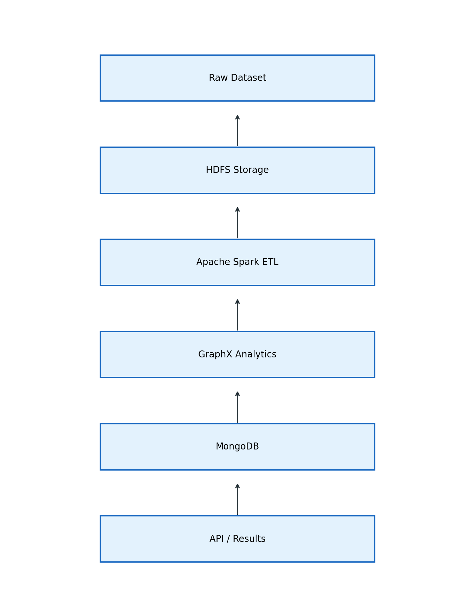

# KSRTC Smart Transit System using Big Data Analytics

## Overview

This project implements a Big Data Analytics pipeline for KSRTC bus network analysis by combining distributed processing, graph-based route modeling, real-time data simulation, and an interactive 3D dashboard.

It demonstrates how modern data engineering techniques can be applied to smart transportation systems for route analysis, demand understanding, and transit visualization.

## Key Features

- Multi-route bus simulation across a synthetic KSRTC-style network
- Graph-based route analysis using Spark and GraphX components
- Real-time data pipeline using Kafka producers and consumers
- Traffic analytics, demand insights, and route optimization views
- 3D interactive dashboard built with Streamlit and PyDeck
- Flexible GPS handling with schema normalization and speed derivation

## Technology Stack

| Component | Technology |
| --- | --- |
| Data Processing | Apache Spark |
| Graph Processing | GraphX |
| Streaming | Kafka |
| Backend | Python + Flask |
| Database | MongoDB |
| Visualization | Streamlit + PyDeck |
| Storage | CSV, HDFS-ready pipeline |

## System Architecture



```text
Data Sources (Routes + GPS)
        |
        v
Apache Spark Processing
        |
        v
Graph Analysis (GraphX)
        |
        v
Realtime Streaming (Kafka)
        |
        v
Backend API Layer / Result Storage
        |
        v
3D Dashboard (Streamlit + PyDeck)
```

## Project Structure

```text
ksrtc_project/
|
|-- backend/
|   |-- analysis/
|   |-- api/
|   |-- hdfs_pipeline/
|   |-- realtime/
|   |-- spark_jobs/
|   |-- run_pipeline.py
|   `-- run_pipeline.sh
|
|-- dashboard/
|   `-- dashboard.py
|
|-- data/
|   |-- raw/
|   `-- processed/
|
|-- docs/
|-- results/
|   |-- csv/
|   `-- reports/
|
|-- scripts/
|-- visualizations/
|-- requirements.txt
`-- README.md
```

## Data Description

### Bus Routes

```text
route_id, seq, stop, lat, lon, stop_id
```

### GPS Data

```text
bus_id, timestamp, lat, lon, speed
```

Supported data behavior:

- Multiple CSV schema styles can be normalized
- Column names are standardized automatically
- Speed can be derived from GPS coordinates when needed

## How to Run

### 1. Install Dependencies

```bash
pip install -r requirements.txt
```

### 2. Run Spark Jobs

```bash
spark-submit backend/spark_jobs/graph_analysis.py
```

Optional legacy/local pipeline bootstrap:

```bash
python backend/run_pipeline.py
```

### 3. Run Real-Time Pipeline

```bash
python backend/realtime/kafka_producer.py
python backend/realtime/kafka_consumer.py
```

### 4. Start the API Server

```bash
python backend/api/api_server.py
```

### 5. Launch the Dashboard

```bash
streamlit run dashboard/dashboard.py
```

## Dashboard Features

- 3D interactive transit map
- Moving bus simulation
- Route visualization and stop markers
- Traffic analytics
- Speed distribution analysis
- Demand prediction view
- Route optimization insights

## Results

- Canonical analytics outputs are stored in `results/csv/`
- Final text and markdown summaries are stored in `results/reports/`
- Architecture and chart assets are stored in `visualizations/`
- The dashboard provides interactive exploration of the generated outputs

## Notes

- GPS data in this project is simulated for demonstration purposes
- The API layer is implemented for future dashboard integration
- The dashboard currently reads generated CSV outputs directly for reliable demos
- The HDFS layer is prepared for scalable storage and Spark/HDFS deployment
- `results/csv/` is the primary output folder for analysis artifacts

## Future Scope

- Real-time GPS integration with live transport feeds
- Machine learning based route optimization
- Smart city deployment workflow
- Mobile application integration

## Conclusion

This project demonstrates an end-to-end Big Data Analytics system that integrates distributed processing, graph analytics, real-time streaming, and advanced visualization.

It provides a strong foundation for intelligent transportation system experiments and smart transit decision support.
